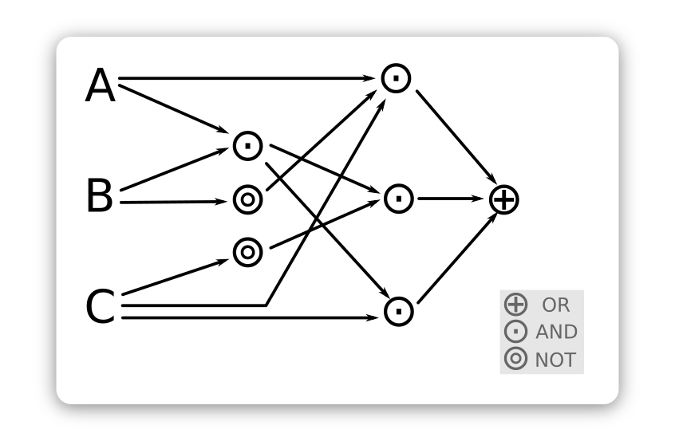
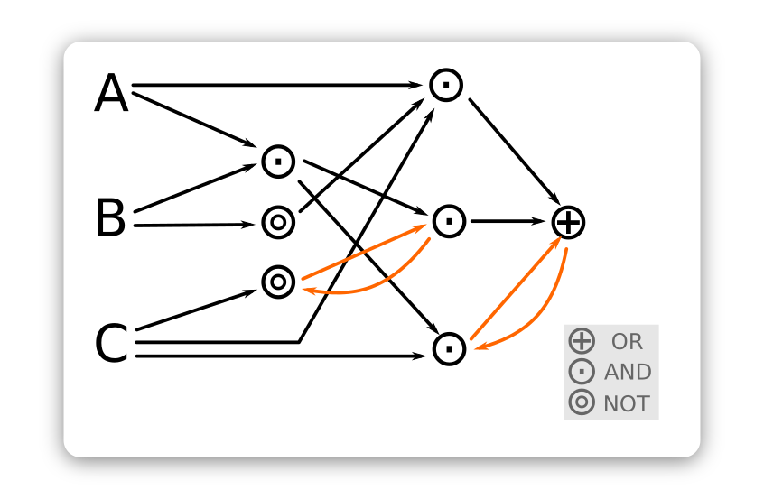

# 環驅之鑰

為本人專案導向學習的主要專案之一。旨在建立以布林代數為基礎描述智能體的理論及應用框架。本項目包含了與人工智慧領域關聯較高；且涉及核心算法（或 spec）的核心項目 (core subject) ，與關聯性較低的各種應用項目的次級項目 (edge subject)。

## 命名

一個簡單的邏輯映射關係可以用 DNF (Disjunctive normal form) 表示，這樣的映射邏輯其輸出只跟當下的輸入有關；換句話說它沒有記憶能力。

這個映射邏輯也可以用 DAG (Directed Acyclic Graph) 描述，

為了讓它有記憶的能力，我們把它加上遞歸 (Recurrent) 的連結，

此時這個映射邏輯部份的邏輯便受到這個環 (Directed cycle graph) 的支配，因此一個有學習能力的智能體其表現出「學習」的行為是受到這些環所支配的，「環驅」就是「受到圖環驅動」的意思。

  
Wei Ji以[創用CC 姓名標示-相同方式分享 4.0 國際 授權條款](http://creativecommons.org/licenses/by-sa/4.0/)釋出。

###### tags: `The Key Of Huanche` 
