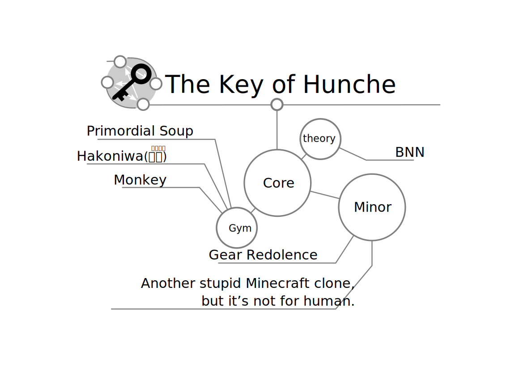
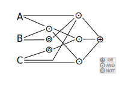
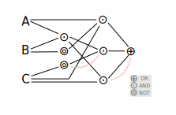
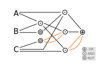

# 環驅之鑰

為本人專案導向學習的主要專案之一。旨在建立以布林代數為基礎、描述智能體的理論及應用框架。本項目包含了與人工智慧領域關聯較高、且涉及核心算法（或 spec）的核心項目 (core subject) ；與關聯性較低的各種應用項目的次級項目 (minor subject)。

## 動機
- [論開放世界原生智能體的發想](./core/The_Idea_of_Native_Agents_in_a_Voxel_World/README.md)
## 基礎理論

- [熵庫 (Entropy Reservoir) 假說](./core/Entropy_Reservoir_Hypothesis/README.md)
- [一種表達智能的方法](./core/A_Kind_of_Way_to_Express_Intelligence/README.md)
- [布林類神經網路](./core/Boolean_Neural_Network/README.md)

## 演算法

- [一種布林拓撲進化類神經網路基因演算法](./core/A_Kind_of_Algorithm_that_Boolean_Neuroevolution_of_Augmenting_Topologies/README.md)
- [一種以拓撲排序作為遞迴中止條件之方法](./core/A_Kind_of_Method_to_Interrupt_Recursion_by_Topological_Sorting/README.md)
- [一種透過人工介入編輯網路的方法發想以及網路內化假說](./core/A_Kind_of_Method_Which_Network_Editing_Intervened_by_Human_and_the_Hypothesis_of_Network_Internalization/README.md)

## 延伸理論

- [智能體資訊複雜度](./core/The_Complexity_of_Information_Flow_in_the_Agents/README.md)
- [一種利用資訊熵獎勵智能體構建方塊世界(Minecraft)的方法](./core/A_Way_to_Reward_Agent_Which_Constructed_Voxel_World_Minecraft_by_Shannon_Entropy/README.md)
- [ 一種基於力學破壞對方塊世界中的建築結構進行的懲罰](./core/A_Kind_of_Algorithm_that_Architectural_Construction_Punishment_by_Mechanical_Failure_in_Voxel_World/README.md)
- [映射方塊世界到球形宇宙](./core/Mapping_Voxel_World_to_Sphere_Universe/README.md)

## 專案的命名

一個簡單的邏輯映射關係可以用 DNF (Disjunctive normal form) 表示，這樣的映射邏輯其輸出只跟當下的輸入有關；換句話說它沒有記憶能力。

這個映射邏輯也可以用 DAG (Directed Acyclic Graph) 描述，

為了讓它有記憶的能力，我們把它加上遞歸 (Recurrent) 的連結，

此時這個映射邏輯部份的邏輯便受到這個環 (Directed cycle graph) 的支配，因此一個有學習能力的智能體其表現出「學習」的行為是受到這些環所支配的，「環驅」就是「受到圖環驅動」的意思。

  
Wei Ji以[創用CC 姓名標示-相同方式分享 4.0 國際 授權條款](http://creativecommons.org/licenses/by-sa/4.0/)釋出。

###### tags: `The Key Of Huanche` 

