# 一種基於力學破壞對方塊世界中的建築結構進行的懲罰

原本是想寫應力分析的演算法，但是不知道為什麼寫出來反而變得像是彎矩分析。

### 緣起

> ~~其實我看 Minecraft 的物理引擎不爽很久了~~ 

Minecraft 原生的遊戲環境允許浮空方塊，
當然在有秩序的伺服器或守序的玩家遊玩下，
這樣的配置可以生成諸如浮空城、飛艇...之類美麗雄偉的造物，
但是訓練過程的 AI 是相當無序的，
可以想見 AI 對地形造成的破壞會十分接近 2b2t 重生點的程度。
在混亂的環境中成長的 AI 勢必會把浮空方塊視作環境特徵而妥善利用它，
這與我所期望能夠建立帝國般秩序的 AI 相左。

這幾天剛好想到：
> 為什麼沒有 3D 版本的 Falling-sand game？🤔

以 Powder Toy [^Powder_Toy]為例，它基本就是一個微縮的二維物理模擬器，甚至能夠在之中模擬核電廠的運作。最小單元是像素意味著它的運算方式是一格一格的，而不是在向量空間飛行的質點。似乎可以很容易得出結論：三維的 Falling-sand game 應該長得像是 Minecraft。在查了一些 Powder Toy 的影片之後，程式魂被悄悄的點燃了。

接著確認看看有沒有人寫過 Minecraft 的重力模組：有。

BlockPhysics 賦予了土壤和沙子（很離散的）流動性，並且讓磚塊遵守某種規則而不掉落，其規則基本上來自周圍 3x3x3 其他的方塊。看得出來他就是寫了一些判斷式去偵測方塊周遭的方塊並且判斷掉不掉落，以及放置方塊時的加入一些判斷。[^BlockPhysics]

恩...這不是我想要的，主要是因為它仍然允許一些奇形怪狀的建築，我希望透過力學約束逼迫機器學習產出的建築物必須遵從某種程度上的結構設計。

於是我建了兩個演算法的模型：一個用來處理撞擊破壞、一個用來處理重力破壞，前者不是本文的討論重點，讓我們先把重點放在重力破壞上吧。

### 總之先寫程式

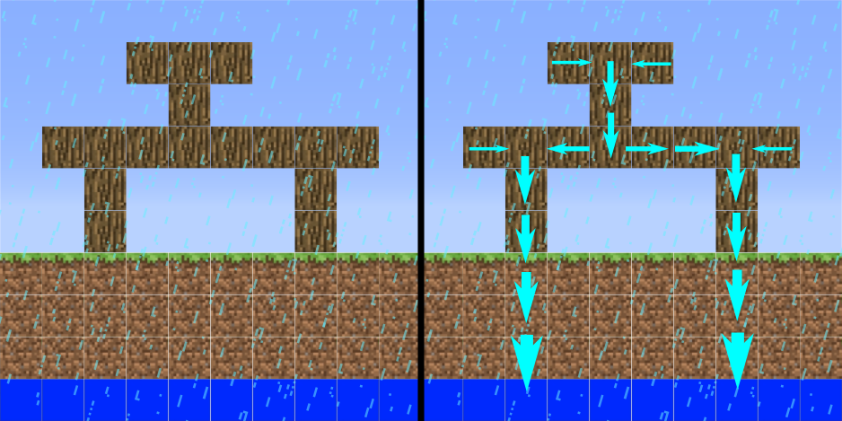

一開始的概念是這樣的：
> 每過一個微量時間，「重力能」就會被施加在微元素上；「重力能」會從「重力能」的地方往低的方向流，形成「重力流」；最後流向大地，大地邊界會消除「重力能」。
> 微元素累積的「重力能」大於逃溢能時（臨界），微元素就會發生破壞。

簡單建了個模型就開始寫程式：
$$
g'(x) = \frac{g_{x-1} + g_{x+1}}{2} + k
$$

當下其實沒有考慮太多數學上的事，就是很直覺的隨便寫了一些算法，
然後丟試算表或是丟腳本（程式）跑跑看，接著驗收跑出來的圖。

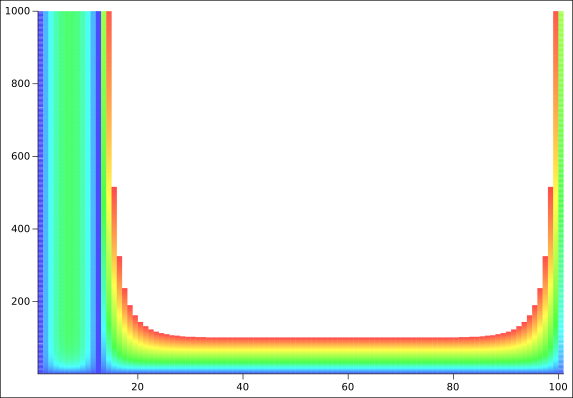

x 軸是微元素的一維分佈，y 軸是演算法迭代時間，分別在 $x=0,12,99$ 的地方放置支點，會吸收重力能。把 $t=1,000$ 的重力能分佈圖繪製出來：

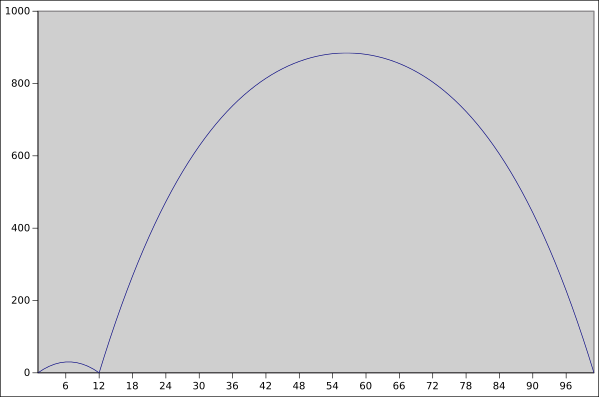

...恩？我怎麼對這分佈好像有印象？

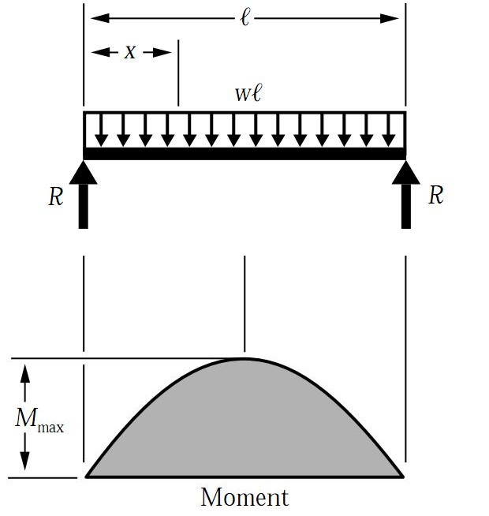

是出現在剪力-彎矩圖的彎矩啊啊！

### 模型的數學解析

若考慮一維空間中，每個微元素含有「重力能」的函數為 $g(x)$，
不考慮持續施加的重力能，僅考慮流動，離散描述：
$$
g'(x) = \frac{g_{x-1} + g_{x+1}}{2}
$$

經過整理可以得到：
$g'(x) = 
\frac1{2} ((g_{x-1} - g_x)+( g_{n+1} - g_x)) + g_x$

因此可以導出：
$\frac{\Delta g }{\Delta t}= 
\frac1{2} ((g_{x-1} - g_x)+( g_{x+1} - g_x))$

繼續整理：
$\frac{\Delta g }{\Delta t}= 
\frac1{2} (( g_{x+1} - g_x) - (g_{x} - g_{x-1}))$

這是什麼呢？
$\begin{align}
  \frac{\Delta g }{\Delta t}
    &= \frac1{2} (\frac{\Delta g_{x+1}}{\Delta x} - \frac{\Delta g_{x}}{\Delta x}) \\
    &=\frac12 \frac{\Delta \Delta g}{\Delta x\Delta x}
\end{align}$

寫成連續型態：
$$
\frac{dg}{dt} = \frac{d^2 g}{dx^2}
$$

這不是熱傳方程式嗎！？(╯°Д°)╯︵ ノ(｡ー｡)ヽ

對吼，畢竟就是用流動的概念去寫的，難怪會跑出熱傳（擴散）方程式 (ヽ°Д°)ヽ ヽ( °_° )ノ

### 解微分方程
好噠，手上有一個微分方程，這讓我很好奇 $g$ 究竟長怎樣
$$
\frac{d\,g}{d\,t} = \frac{d^2\,g}{d\,x^2} +k
$$

首先，我想知道運算收斂時 $g$ 的狀態，因此：
$$
\frac{d^2\,g}{d\,x^2}=-k \Big|_{\frac{d\,g}{d\,t}=0}
$$

積分兩次我會得到：
$$
g(x)=-\frac12 k x^2 + c_1 x + c_2
$$

這是...開口朝下的拋物線呢！跟畫出來的曲線一樣呢！(´°ω°\`)

### 其他嘗試 - 有限重力能
在幾個早期版本的腳本測試中，我並沒有注意到收斂的現象，
應該是撰寫的腳本本身有 BUG，print 出來的數值會發散，
於是我試著加入條件：
> 整個系統的「重力能」是有限的

也就是對整個系統而言，重力能的變化為零：
$$
\int_{\Bbb S} \frac{d\,g}{d\,t} d\,t =0
$$

這使得 $k$ 不再是常數，實驗結果如下：

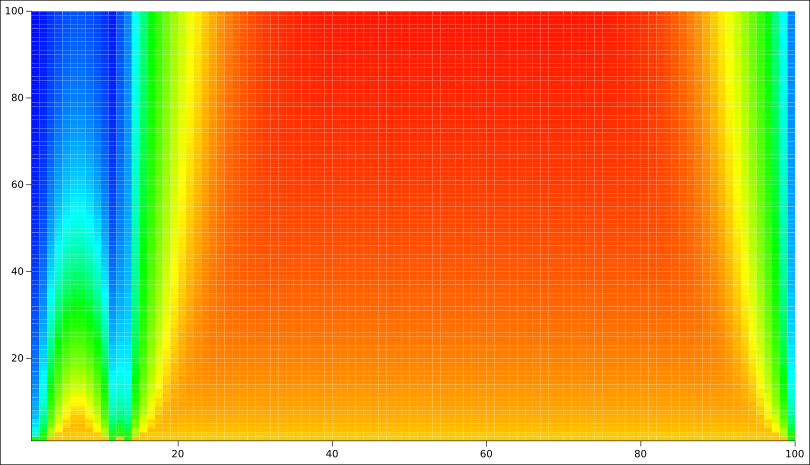

在 $t=100$ 的狀態畫成 g-x 曲線圖：

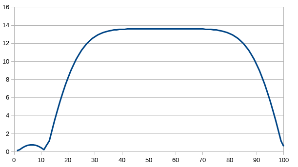

重力能都被間距比較大的區域吃掉啦！！ ((( °Д°)))

### 看起來它真的是彎矩
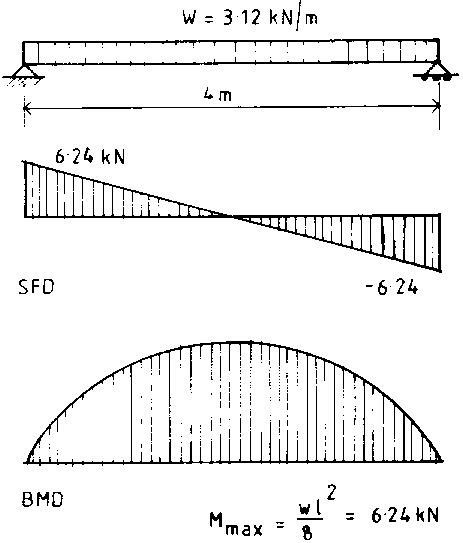

在均佈荷重的力學模型中，

$$
V(x)=-\int w(x)\,dx \\
M(x)=\int V(x)\,dx
$$

$M$：彎矩，$V$：剪力，$w$單位梁受力。

彎矩對距離微分兩次就會得到梁的單位受力 $(N/m)$。[^Direct_integration_of_a_beam]

接著我分別把簡支梁（連續樑）和懸臂梁（外伸樑）的數值丟進試算表求微分值：

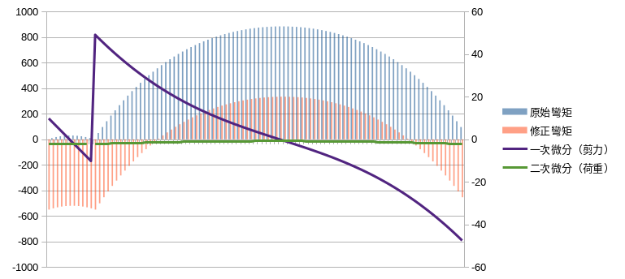

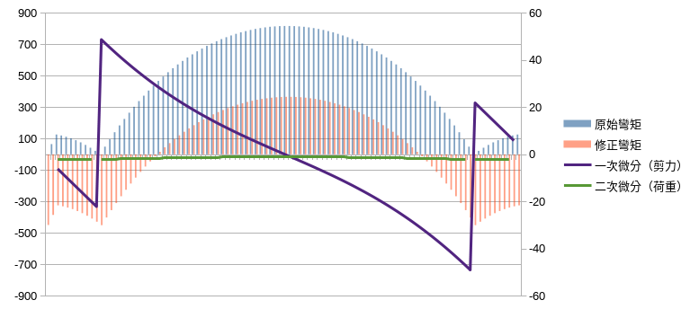

重力能的分佈和彎矩圖其實很接近，但是就是垂直軸的位置不太對，翻了翻資料發現是因為我沒加入 $\sum M= 0$ 的平衡條件。

人工在試算表裡修正後就會得到圖中紅色的部份，看起來的確比較像材料力學裡的彎矩分佈圖了，
透過微分也很明顯的看到剪力和荷重得出現了。

不過運算出來的荷重和我一開始施加的 $k$ 有一點點落差，誤差百分比高達 30% 。

不過只是要用來懲罰機器學習用的，不用太準應該也沒關係吧（？

接下來的課題是：
> 如何在元素的迭代過程自然的收斂成被修正的「彎矩值」？

### 修飾重力能
我們可以發現「重力能」是大於零的參數，其和必不等於零，
可以透過該方式補正：
$$
g_m(x) = g(x) + m
$$

$g_m$：修飾重力能，修正後的重力能用來匹配相對真實的彎矩分佈。
$g$：原始重力能。
$m$：修正項，為了使彎矩值滿足平衡條件 $\sum M =0$

修正項應該為重力能加總的平均值：
$$
m = -\frac1x \int g d\,x
$$

透過和重力能一樣的計算方式，使用流動的方式來收斂解：
$$
\frac{d\,m}{d\,t} = \frac{d\,g}{d\,t} + \frac{d^2\,m}{d\,x^2}
$$

當重力能收斂時，即 $\frac{d\,g}{d\,t}$ 趨近於零，修正項 $m$ 的變化便會受到擴散微分項主導，最終趨於平均分佈。

重構之後加入修正項的程式結果（迭代次數：1000 ），原始值：
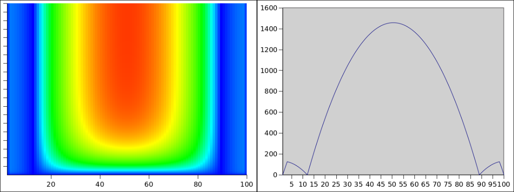

修正項：
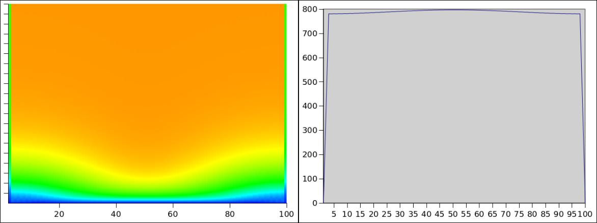

修正值：
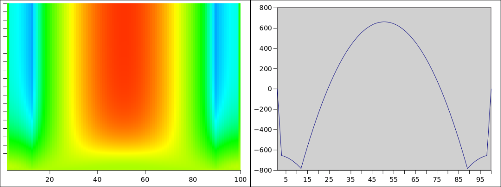

### 二維模型驗證
完成一維模型驗證之後，接下來換二維了，
不過為了方便下一個階段（三維）的驗證，程式碼是直接寫成三維的。
一個 chunk 是由 $100 \times 100 \times 100$ 個元素構成，
下圖是 $(x,0,z)$ 平面的剖面圖迭代 1000 次的收斂過程：

### 加入破壞機制
崩潰模型採用：當重力能或修正重力能大於臨界點便直接移除該方塊。

### 程式碼
https://github.com/FlySkyPie/the-architectural-construction-punishment-by-mechanical-failure-in-voxel-source

###### tags: `development note`

[^Powder_Toy]: The Powder Toy - Wikipedia. (n.d.).Retrieved 2020-01-09, from https://en.wikipedia.org/wiki/The_Powder_Toy

[^BlockPhysics]:  BlockPhysics Mod 1.7.10 (Real Collision) - 9Minecraft.Net. (n.d.). Retrieved 2020-01-09, from http://www.9minecraft.net/blockphysics-mod/

[^Direct_integration_of_a_beam]: Direct integration of a beam - Wikipedia. (n.d.). Retrieved 2020-01-09, from https://en.wikipedia.org/wiki/Direct_integration_of_a_beam

