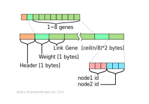
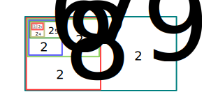
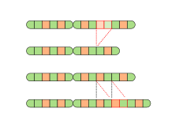
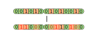
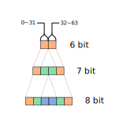

# 一種布林拓撲進化類神經網路基因演算法

給定類神經網路輸入與輸出節點的數量，並給定資料集的前提下，究竟要設定多少隱藏神經元才能完成任務？這個問題可以理解成：

> 在已知環境；且任務明確的前提下，智能體要具有多少資訊才能完成任務？

當環境本身的資訊量非常龐大時，我們無法量化環境究竟具有多少資訊的情況，似乎也無法計算出智能體究竟需要多少資訊才能完成任務。綜觀生物演化，想必不是「先設想需要多少基因」再演化出能夠活下來的生物，而是「能夠活下來的生物自然擁有這麼多的基因」，因此隨著訓練過程同時嘗試較多神經的網路與較少神經的網路，最後能達成任務的網路大小就是好的網路大小。

## 基因編碼

一個布林類神經網路可以用一段染色體描述，染色體區分成兩個部份：

- 定址基因
- 連結基因

定址基因決定這個網路擁有多少節點，換言之，決定網路的大小。連結基因則是描述兩個節點之間的連結。

### 定址基因

決定熵庫大小的基因。若定址基因儲存的變數為 $n$，則網路具有 $2^n$ 個節點，因此在定址基因為 1 byte 的前提下，本基因算法的定義最多可以描述有 $2^{256}$ 個節點的布林類神經網路。

### 連結基因

一段連結兩個類神經元節點的資訊可以被描述為：

$$
l=(a_1,a_2,w)
$$

- $a$ : address， 連結的定址， 訊號將會從 $a_1$ 送往 $a_2$
- $w$ : weight，權值，決定訊號邏輯是否會被反轉

因此一段用來描述連結的基因有三個部份：
- 來源節點
- 目標節點
- 權值

### 基因資料空間用量

> 資料應該儲存為文字檔案
> -- <cite>The UNIX Philosophy</cite>[^UNIX_Philosophy]

使用二進制編碼的染色體檔案會無法直接被人類閱讀，這其實是有違 Unix 哲學的，若沒有良好的理由應該避免這麼做。因此接下來試著計算這麼做在資料壓縮上的利益。

若一網路以 100 萬畫素相機作為輸入：

- RGB -> 3 個 100 萬矩陣
- 一個色彩值 0~255 -> 每一個單色像素花費 8 bit 的資料

總計 24,000,000 個布林輸入：

$$
1,000,000 * 3 * 8 = 24,000,000
$$

布林類神經網路理論要求至少要4層網路

- 1層輸入層
- 2層隱藏層
- 1層輸出層

假設輸出值只有一個位元，因此先不考慮輸出層，總計需要 72M 個節點：

$$
24 M * 3 = 72 M
$$

即定址空間至少為 27 位元：

$$
\log_2(72,000,000) = 26.1
$$

則一個連結至少需要多少資料表達：

$$
27+27+1 = 55 \text{ bit}
$$

若使用字串描述十進制，則連結資訊至多會消耗 9 位數，平均消耗 8 位數：

$$
2^{27} = 134,217,728
$$

若使用字串儲存（十進制），
`[定址1][定址2][權值][分割字符]`

$$
8 \text{ char} + 8 \text{ char} + 1 \text{ char} + 1 \text{ char} \\
=18 \text{ bytes} = 144 \text{ bit}
$$

不過目前多使用 UTF-8 編碼，因此儲存空間會變成兩倍: 288 bit，
結論：使用二進制定義的資料壓縮率為 0.19

## 突變機制

任一染色體經過突變之後會得到新的染色體：

$$
G' = f(G,m)
$$

$G'$: 後代染色體，為隨機變數
$G$: 染色體
$m$: 突變率，或為複製失敗的機率

### 定址基因

對染色體而言，定址基因有 $m$ 的機率會複製失敗，
而失敗時又有 0.5 的機率會增加； 0.5 的機率會減少，
因此當定址基因突變時，有一半一半的機率會加一或是減一，
從而觸發「定址擴張」或「定址萎縮」的事件。

### 連結基因

參考染色體的異常模式[^Chromosome_abnormality]：

- deletion
- duplication
- inversion

考量 inversion 的破壞性，只保留前面兩者突變機制，因此對一段基因而言，突變的機制有兩種：

- 刪除
- 複製

複製可以用來探勘解；刪除則可以用來收斂解。
對基因而言，有 $m$ 的機率會複製失敗，當複製失敗時有 0.5 的機率發生刪除；0.5 的機率發生複製。

### 位元突變

位元突變是每一個位元的基因在複製給下一代時，
皆有一定機率 $m$ 會發生複製錯誤，即邏輯反轉。

透過基因複製與位元突變，便可產生不同的連結基因並增加網路的連結進而曠大網路的大小。

### 定址擴張與萎縮

當定址基因發生突變時，整個網路的熵庫就會發生擴張或是萎縮。我們通常將輸入放置在拓撲排序的前方而輸入放在後方，因此當網路方生擴張時，會將原生的網路資訊一分為二，將後段部神經元的編號映射到新的熵庫後方。萎縮時則反向操作，與中間節點有關的所有連結資訊都會被刪除。

[^UNIX_Philosophy]: Unix哲學 - 維基百科，自由的百科全書. (n.d.). Retrieved 2019-11-21, from https://zh.wikipedia.org/wiki/Unix哲學

[^Chromosome_abnormality]: Chromosome abnormality - Wikipedia. (n.d.). Retrieved 2019-11-21, from https://en.wikipedia.org/wiki/Chromosome_abnormality

###### tags: `The Key Of Huanche`