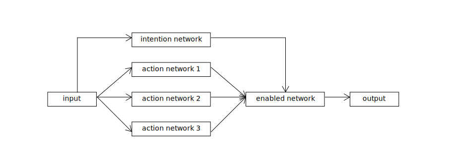
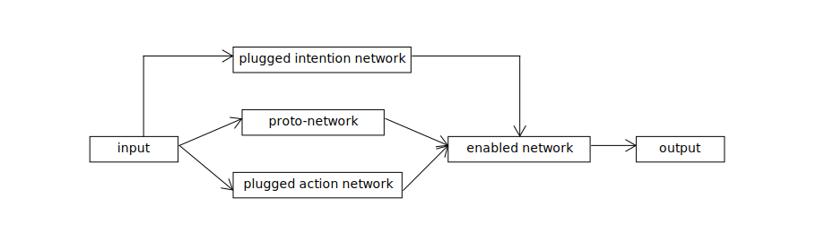

# 一種透過人工介入編輯網路的方法發想以及網路內化假說 

本文提及的網路是使用在增強式學習環境中，換句話說該網路必定涉及被該網路所驅動的代理人 (agent) ，並且下來假設代理人是 Minecraft-like 遊戲中的機器人 (BOT) ，並且網路是使用 Boolean-Recurrent-Evolving Neural Networks through Augmenting Topologies 複合式演算法生成。

## 意圖與行為

Minecraft-like 的環境是相當複雜的，因此在之中活動的代理人必須具有相對複雜的智能，若考量所有環境因素，代理人的任務就是「生存」，但是生存是一項相當抽象的任務，若對其進行實驗（訓練），會有如疲勞測試 (Fatigue testing) 一般耗費大量時間。因此實務上應該將該任務切割成數個具體的行為，如：採礦、伐木、狩獵...，若是針對這些行為；訓練條件就很容易指標化了，比如單位時間內的採集數量，如此以來實驗的時間便可獲得控制。這些能夠完成特定工作或任務的網路便被稱為行為網路 (action network) 。

隨著規劃不同的任務以及設計指標，我們能夠訓練出數個不同的行為網路來滿足不同的任務，但是這些網路仍相互獨立，為了能夠整合這些網路，因此需要一個用於決策的演算法。

這個演算法同樣透過類神經網路來完成，而這個網路可以透過很多種方法產生，比如：

- 真實玩家的遊玩體驗
	- 某條件對應某個決策標籤（打怪、挖礦、睡覺...）
- 將某個人造的演算法作為訓練資料集
	- 演算法本身必須要被網路化

注意，這些資料都需要被標籤，因為我們需要將這些決策配對到對應的行為網路。這個用於決策的網路就叫做意圖網路 (intention network)，它用來使代理人從環境中獲得的資訊映射到某種意圖，如：

>  血量低下且面臨敵人（環境資訊） → 逃跑（意圖）

而後「意圖」驅動「行為」，做出代理人當下應該做出的具體的「操作」。

整個網路最終的結構應該會像是這樣：

不難看出，其中的智能網路 (enabled network) 其實就是一個多工器，而決策網路則是單純的分類。

## 網路內化假說

每一個網路單元的職責相當明確，因此人工調適的網路結構是能夠被解釋的白箱，若將人工調適的網路送回訓練環境進行迭代。代理人在環境中迭代數個世代後，這些網路單元會慢慢的融合在一起，最後這些人工調適網路的後代其結構會融合到人類難以辨識和區分的程度。

原本由人工賦予的概念，在網路融合的過程中可能會被分離或是合併，比如：原本設計在決策網路中的「挖礦」與「伐木」可能合併變成某種類似「採集」的概念，只是我們無從解析這個概念以何種形式存在於類神經路中，這個過程我稱為網路內化 (Network Internalization)  。

## 意圖與行為注入

首先根據需求定義新的決策基準以及行為，並且透過訓練獲得行為網路以及決策網路，並且先前整合的網路可以直接當成一個網路單元 (proto-network) 看待。

加入的意圖網路具有最高的決策權，只有當該意圖網路判斷符合被注入行為的執行條件，才會啟用注入的行為網路，除此之外的條件都會沿用原網路的操作。

注入行為後再次放回訓練環境（野放），這些特徵便會內化成後代網路的一部分，如果是有用的特徵就會繼續存在，而無用的特徵則是會被迭代掉。透過這種方式不斷的循環經過「注入→內化」的過程來達到人工干涉網路演化的目的。

###### tags: `The Key Of Huanche`