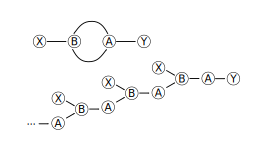
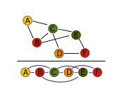
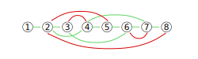

# 一種以拓撲排序作為遞迴中止條件之方法

拓撲進化類神經網路 (NEAT) ，必定有會自然演化出遞歸 (recurrent) 結構，若不能妥善處理遞歸衍生的問題，演算法就不能完備。下圖是一個遞歸結構的範例：

不難看出它是一個遞迴構造，最大的問題就是如何處理遞歸連結造成的遞迴？有一種方式是規定遞迴深度（次數）[^recurrent_1]，或是將整個網路的連接都定義為遞歸連結[^recurrent_2]。

## 類神經網路拓撲結構的數學定義

類神經網路是以抽象連結的方式存在，即使為了視覺化而把網路成現在平面或立體中，
這些連結的長度與神經元之間的距離並不影響神經網路的性質，
因此類神經網路存在於拓撲空間而不存在於度量空間，又或是說類神經網路具有拓撲性質。

首先我們定義有序對（Ordered pair）[^Ordered_pair]，之後要用來處理有向圖（directed graph）的連結：

$$
(x,y):=\{\{x\} ,\{x,y\} \}
$$

定義這個的作用是什麼？拓撲學會大量使用集合論，但是如果我們把連結的頭尾單純丟到一個集合中，如： $a = {x_1,x_2}$ ，並不能描述誰是頭誰是尾，而只能描述條連結線而已，所以定義一個能夠對兩個元素產生後差異的數組十分重要。

定義一張有向圖 (Directed Graph)[^Graph]：

$$
G := (V,A,W)
$$

V：頂點集（vertices set），紀錄了所有點

A：連結集，紀錄了點與點的有向連接（箭頭,arrow）

W：權重集，紀錄了連結的權值
$$
A :=\{(x,y)|x,y \in V\} \\
W \in \Bbb R \\
f:A \rightarrow W
$$

## 拓撲排序

對一個有向無環圖 (Directed Acyclic Graph) 而言，它是可以被排序的：

當拓撲結構被排序後，就有了前後的相對關係，如此一來我們就能判斷連結究竟屬於前饋的還是遞歸連結。呼叫遞迴時，連結由前往後傳遞時呼叫遞迴產生新值；由後往前傳遞時則回傳舊值，。

但是拓撲排序只適用於無環的結構，當圖上有環，拓樸順序就不存在。因為環上每一個點都會有連向自己的邊，意味著環上每一個點必須排在其他點的後方，環上每一個點都不能在排列順序中拔得頭籌，所以合理的排列順序不存在。[^DirectedAcyclicGraph]

那麼假若拓撲結構一開始就定義了順序呢？

如此一來在任一節點呼叫遞迴，必然存在中止條件。實做的時候也很方便，可以直接沿用節點的編號作為拓撲排序的依據，而不需要額外的變數來處理遞迴中止條件。

[^recurrent_1]: Encog NEAT Structure | Heaton Research. (n.d.). Retrieved 2019-11-21, from https://www.heatonresearch.com/encog/neat/neat_structure.html

[^recurrent_2]: NEAT（基於NEAT-Python模組）實現監督學習和強化學習 - IT閱讀. (n.d.). Retrieved 2019-11-21, from https://www.itread01.com/content/1549347330.html

[^Ordered_pair]: 有序對 - 維基百科，自由的百科全書. (n.d.). Retrieved 2019-11-21, from https://zh.wikipedia.org/wiki/有序對

[^Graph]:  圖 (數學) - 維基百科，自由的百科全書. (n.d.). Retrieved 2019-11-21, from https://zh.wikipedia.org/wiki/圖_(數學) 

[^DirectedAcyclicGraph]: 演算法筆記 - Directed Acyclic Graph. (n.d.). Retrieved 2019-11-21, from http://www.csie.ntnu.edu.tw/~u91029/DirectedAcyclicGraph.html

###### tags: `The Key Of Huanche`