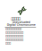
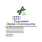
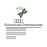
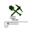
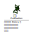

# BNN Tools

## 對象

| 1 | 2 | 3 |
| :---------------------------------------------------: | :-------------------------------------------------: | :----------------------------------------: |
|  |  |  |

## 工具

## 行為

