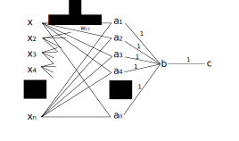

# 布林類神經網路

目前電腦科學的基礎與人類大腦的運作基礎有著巨大的差異，
即便再怎麼使用電腦去模擬人腦的運作，
除非在硬體層面做出改變，不然它的本質仍然是由邏輯閘構成的電路，
忽略本質而專注於表象的行為，有如貨物崇拜一般，
只不過我們崇拜的對象是大自然與其的造物—我們。

這些「模擬人腦的電腦」終究只是蠟做翅膀的翅膀，
無法到達我們期望它到達的高度—強人工智慧。

引用**模仿遊戲**劇中的一段話：

> Of course machines can't think as people do. A machine is different from a person. Hence, they think differently. The interesting question is, just because something, uh.. thinks differently from you, does that mean it's not thinking?
> -- <cite>Alan Turing (The Imitation Game)</cite>

眼界僅放在如何讓演算法更接近我們的大腦，
似乎是一種傲慢；一種「如果機器不像我們一般思考，它怎麼可能會思考」的傲慢。
不要會錯意了，並不是說不能向大自然的經驗取經，
我們不應該一謂的模仿而忽略背後的本質；不應該讓自身的傲慢蒙蔽了可能性。

在我們討論神經元的脈衝特性、各種函數的微分方程、LSTM 模塊之前，
讓我們先回歸電腦科學理論基礎「布林代數」吧？

## 布林神經元
Boolean Neural Networks[^1] 的論文中定義了布林代數的神經元：

$$
y =   \underset{i}{\overset{n}{ \oplus}} (x_i \land w_i) 
$$

- $\underset{i}{\overset{n}{ \oplus}}$：n 輸入 XOR 運算
- $\land$：AND運算

可以看出這樣的設計有幾個目的：

- XOR 是為了使網路能構成任意布林函式
- AND 是為了作為遮罩篩選輸入

為了解釋接下來我要提及的問題，先將神經元簡化：

$$
y =   \underset{i}{\overset{n}{ \oplus}} (x_i ) |w_i = 1
$$

使用多輸入 XOR 會造成該神經元對於輸入過於敏感，
任意輸入的變化都會造成輸出值的變化，
這有違為了模擬生物電荷激發的原本神經元模型，
因此我對該布林神經元模型進行了一點修正。


## 布林神經元修正
任意事件都可以被描述成伯努力試驗，即：

- 成功（發生）（真）
- 失敗（沒發生）（假）

而任意事件的條件，同樣可被如此描述，某現實事件的因果關係可以被描述為：

> 先驗條件一為真；且先驗條二為真；且先驗條件三為真，事件發生為真。

神經元就像現實事件的微縮模型，除了用電荷脈衝來理解，也可以這樣看：

> 連結一觸發為真；且連結二觸發為真；且連結三觸發為真，神經元被激發為真。

如果把這個表述寫成數學式：

$$
y = x_1 \land x_2 \land x_3 = \underset{i}{\overset{3}{ \land }} (x_i) 
$$

任意事件的發生與否可以被描述成一個布林函式，然而僅靠 AND 無法描述任意布林函式，於是令原本作為遮罩的神經元權值擔任邏輯反轉的工作，使真觸發的邏輯變成假觸發。而不使用該隨機變數的情況，就交給不完全連結( NEAT )[^NEAT]來達成。

$$
y =   \underset{i}{\overset{n}{ \land }} (x_i \oplus w_i) 
$$

- $\underset{i}{\overset{n}{ \land}}$：n 輸入 AND 閘運算
- $\oplus$：互斥或運算

- XOR 運算用來轉換邏輯
- AND 運算用來疊加觸發條件
- 原先布林代數的遮罩[^1]由不完全連結實現
- 不完全連結會使網路不能進行矩陣運算，沒關係，我本來就打算使用在無法使用矩陣運算的 RNN(recurrent neural network) 場合

## 構成任意布林函數

以下證明如何基於該神經元假設構成任意布林函數，
任意布林函數能夠被描述成 DNF[^DNF]，
因此只要布林網路能夠構成 DNF 的形式便能構成任意布林函數。

DNF 主要分成兩個部份：

- AND 型態函數 (ABC)
- OR 型態函數 (A+B+C)

每一個 OR 型態的變數皆為 AND 型態函數，因此只要網路能夠分別構成兩者，便可構成 DNF 函數。

### AND 型態
布林神經元的基本運算就是 AND 運算，因此只要一層神經元便可構成 AND 型態的函數，舉例：

$$
ABC = (A \oplus 0)(B \oplus 0)(C \oplus 0)
$$

NOT 運算的係數則由權值提供。

$$
F(A,B) =\\
\underset{i}{\overset{n}{ \land }} (b_i) = 
\underset{i}{\overset{n}{ \land }} (a_i \oplus w_i),
w_i =
    \begin{cases}
      0, &  a_i = b_i \\
      1, &  a_i \neq  b_i
    \end{cases}
$$

- $A$：原始輸入變數集合
- $B$：實際輸入變數集合，部份變數可能經過 NOT 修飾，如：$b_i = \overline{a_i}$


### OR 型態
神經元模型使用 AND 作為基礎運算，因此需要經過轉換才能實現 OR型態，舉例：

$$
A+B+C = \overline { \overline {A+B+C} } =
\overline{ \overline A \overline B \overline C } = \\
((A \oplus 1)( B \oplus 1)(C \oplus 1)  )\oplus 1
$$

可以看出至少需要經過兩層神經元才能完成 OR 型態的函數。

$$
F(A,B) = G(A,B) \oplus 1 \\
G(A,B) = 
\underset{i}{\overset{n}{ \land }} (b_i) = 
\underset{i}{\overset{n}{ \land }} (a_i \oplus 1)
$$

### 網路結構
將上述的兩種網路結構合併後繪製出來便可得到下圖：



不過過實際使用我們不會使用這個結構，
這些推導不過是給出我們使用布林神經元模型下網路層數的下限罷了，
（避免開開心心的拿著一層布林網路去訓練卻發現擬合不了```｡ﾟヽ(ﾟ´Д`)ﾉﾟ｡ ```）
一來是因為這種結構篩選資料特徵的模式十分有限，
二來是全連結會造成部份連結的非必要性，畢竟布林函數是可以化簡的。

## MURMUR

論文[^1]給出了布林代數模型的神經元，是參考自另一篇只給出 XOR 函數的論文[^second]。然後經過一番折騰，這筆者又發了另一篇[^third]要補充原始稐文的不足，實驗了 OR 或是 AND 構成函數的兩種情況，結果為什麼先 XOR 再 AND 卻沒提到...

[^1]:  ROMAN KOHUT, BERND STEINBAC. (2004). Boolean Neural Networks . Retrieved 2019-09-29, from https://pdfs.semanticscholar.org/1c47/2945ab2970a709efe97f81d9a5e7bf37baae.pdf

[^second]: Bernd Steinbach, Roman Kohut. (n.d.). Neural Networks – A Model of Boolean Functions. Neural Networks – A Model of Boolean Functions. Retrieved 2019-09-29, from https://pdfs.semanticscholar.org/74f4/e337add835e4122cdc62179653b6bcf776b0.pdf

[^third]: Roman Kohut, Bernd Steinbach. (n.d.). Decomposition of Boolean Function Sets for Boolean Neural Networks. Retrieved 2019-09-29, from https://pdfs.semanticscholar.org/bc54/e76713f482d173b934ad6d4aad5f232258a7.pdf

[^NEAT]: Kenneth O. Stanley, Risto Miikkulainen. (n.d.). Evolving Neural Networks throughAugmenting Topologies. Retrieved 2019-09-29, from http://nn.cs.utexas.edu/downloads/papers/stanley.ec02.pdf

[^DNF]: Disjunctive normal form. (n.d.). Retrieved 2019-09-29, from https://en.wikipedia.org/wiki/Disjunctive_normal_form

###### tags: `The Key Of Huanche`