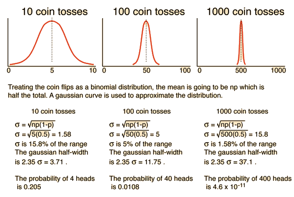

# 熵庫 (Entropy Reservoir) 假說

## 熵—衡量萬物混亂程度的物理量...嗎？

熵 (Entropy) 具有很多種表述方式，比如：

* 克勞修斯熵 $d S = \frac{\delta q}{T}$
* 波滋曼熵 $S = k \ln W$
* 資訊熵（夏農熵） $S = \log_2 2^N = N$

有一種熵的詮釋與「狀態所包含的排列數」相關，波滋曼熵與夏農熵便是如此。以波滋曼熵為例，當中的 W 所代表的意義是微觀物理的狀態數[^Boltzmann's_entropy_formula]：

$$
W={\frac {N!}{\prod _{i}N_{i}!}}
$$

夏農熵中 $2^N$ 則是在 N bit 的空間中；資訊有幾種排列方式。夏農熵有另外一種表述方式[^Entropy_(information_theory)]，在此就先不贅述。

### 總之先擲點硬幣吧！

現在想像一個盒子內裝有 n 枚硬幣，當我隨意上下搖晃盒子，內部的硬幣就會以一半反面一半正面的機率翻面。

我們可以發現 k 枚硬幣正面朝上的排列數可以寫作：

$$
W = \frac{n!}{k!(n-k)!}
$$

以 n=10 為例，我們對 W(k) 作圖：

我們可以發現當 $k=\frac{n}{2}$ 的時候排列數最多，若依照熵的定義；此時的熵應該也是最大的。

### 熵的相對性

雖然特定狀態的排列數可以定義出該狀態的熵值，但是實務上我們考慮的是「熵的變化」：

$$
\Delta S = S_1 - S_0
$$

畢竟當系統十分龐大時，你很難計算或窮舉出它的所有可能的排列（數）。

### 機率使其往高熵發展

根據經驗，我們知道隨著搖晃盒子，硬幣正面、反面朝上的分佈應該會是一半一半。但是我們如何用數學解釋這個現象呢？

這個將硬幣放在盒子內的實驗，可以視作伯努力試驗，而伯努力試驗又可以用二項式分佈來描述：

$$
 f(k,n,p)=\Pr(X=k)=\frac{n!}{k!(n-k)!}p^{k}(1-p)^{n-k}
$$

$k$：成功的次數，在本例的情況是指正面朝上的硬幣數目
$n$：進行試驗的次數，在本例的情況是指總共有多少枚硬幣
$p$：成功的機率，在本例就是正面朝上的機率，也就是 0.5
$\Pr$：機率密度

[^Binomial_distribution]

二項式分佈若繪圖會得到上述圖形，y 軸是機率密度，x 軸則是 k 值。可以看到它的分佈趨近常態分佈。根據二項式分佈的特性我們可以得到其標準差為：

$$
\sigma = \sqrt{np(1-p)}.
$$

隨著 n 增大，其標準差佔整體的比例會越來越窄[^Statistical_Methods]：

若考慮 1,000 枚硬幣，標準差為 15.8 ，跨越 3 個標準差的距離為 453 ~ 547，這代表有 99.7% 的機率，正面朝上的硬幣數量會在 453 ~ 547 這個區間內。

若考慮 1,000,000 枚硬幣，標準差為 500 ，跨越 3 個標準差的距離為 498,500 ~ 501,500，這代表有 99.7% 的機率，正面朝上的硬幣數量會在 498,500 ~ 501,500 這個區間內。

我們可以發現當 n 增大，機率分佈會聚集在少數的某些狀態，而其他狀態發生的機率便顯得微乎其微。

### 有人說熵就是亂度？

我們可以注意到機率分佈會集中在 $k=\frac{n}{2}$ 附近，而 $k=\frac{n}{2}$ 時又是熵最大的狀態，因此我們可以注意到熵越大的狀態越容易自然發生。

不管我怎麼排列這些硬幣，只要隨著搖晃盒子，硬幣的分佈都會往熵最大的狀態發展。令我排列的狀態熵為 $S_0$ ，而最終狀態的熵為 $S_1$ 則：

$$
\Delta\,S>0
$$

不論你從何種狀態往最終狀態變化，其 $\Delta\,S$ 必定大於 0。這就是熱力學第二定律。

當我們排列硬幣時，會下意識的將該狀態視為「有序」，而經過搖晃盒子後，硬幣的分佈狀態則下意識地視作「混亂」，因此看似萬物都會自然往混亂發展，如此以來熵似乎就和混亂掛勾了，似乎熵能夠描述事物的「混亂程度」。「秩序」與「混亂」的狀態其實是相當抽象且無法被明確定義的，「熵代表著混亂的程度」是一種通俗的理解方式，但是也是相對不嚴謹的理解方式。

### 資訊的不確定性與熵的關係

我們來看看兩組資料，其中 x 代表可以為 1 也可以為 0 ，是一個不確定的資料：

1. `10101010`
2. `10x01x10`

根據熵與排列數之間的關係，我們可以發現第一組資料的排列數只有 1 種，後者的排列數則有 4 種，也就是後者的熵較高。

## 資訊體生物的空想實驗

首先想像一個資訊生物，其所承載的資訊會影響這個生物的各種性狀 (Phenotypic trait)，它的資訊是完全明確的，並且任一位元的資訊發生變化就會造成系統異常（遺傳疾病）從而造成生物整體的崩潰：死亡。

接著想像另外一個資訊生物，他有部份的資訊是不確定的，也就是資訊為 1 還是 0 所表現出的性狀皆不會對本體造成關鍵的危害。

想像這兩隻資訊生物被放置於同一個環境之中，前者因為不容許任何錯誤，其後代資訊一定是完全複製的，因為複製錯誤的都會死亡；另外一隻的後代則容許一定程度的變化，這個變化也包含資訊數變多。

不難想像在長時間的迭代中，後者遲早會發展出更多的競爭競爭優勢。如果兩種生物處於相同的環境之中，不會（無法）發生變化的資訊生物會漸漸的在競爭中消失。

### 熵庫 (Entropy Reservoir) 與熵池 (Entropy pool)

資訊生物的資訊都能夠被描述成不確定的部份以及確定的部份，如：

$$
\begin{aligned}
I = (1011010XX0100011XX010101100XXX) \\
 = (XXXXXXX)(1011010,0100011,010101100,)
\end{aligned}
$$

並且任意資訊都能被母體集合 $P$ 包含：

$$
\forall I, I \subset P
$$

這個 $P$ 就是熵庫 (Entropy Reservoir)，理想熵庫是一個無限大的集合，而且充滿了不確定的資訊。被資訊生物收錄的不確定資訊則稱為熵池 (Entory Pool)，任何能夠描述具有競爭優勢的性狀的資訊皆來自不確定資訊的收斂。

描述競爭優勢的確定資訊必須由熵池中的不確定資訊收斂而來；不確定資訊則必須從熵庫獲得。
我們可以將獲得資訊的過程想像成一種開採資源的過程，這種資源必須從不確定資訊收斂而來，而不確定資訊又必須從熵庫中開採，並且整個過程消耗著時間與能源。

[^Boltzmann's_entropy_formula]: Boltzmann's entropy formula - Wikipedia. (n.d.). Retrieved 2019-11-17, from https://en.wikipedia.org/wiki/Boltzmann%27s_entropy_formula

[^Entropy_(information_theory)]: Entropy (information theory) - Wikipedia. (n.d.). Retrieved 2019-11-17, from https://en.wikipedia.org/wiki/Entropy_(information_theory)

[^Binomial_distribution]: Binomial distribution - Wikipedia. (n.d.). Retrieved 2019-11-17, from https://en.wikipedia.org/wiki/Binomial_distribution

[^Statistical_Methods]: Comments on Statistical Methods. (n.d.). Retrieved 2019-11-17, from http://hyperphysics.phy-astr.gsu.edu/hbase/Kinetic/statcom.html

###### tags: `The Key Of Huanche`
