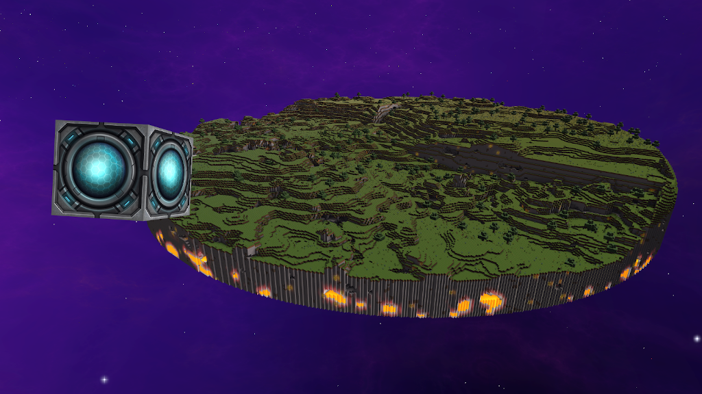
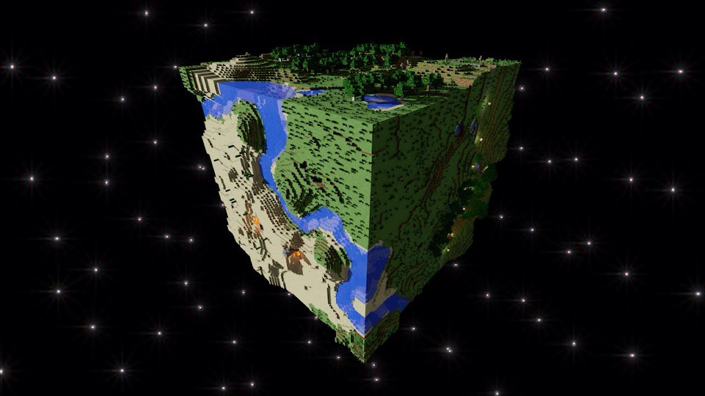
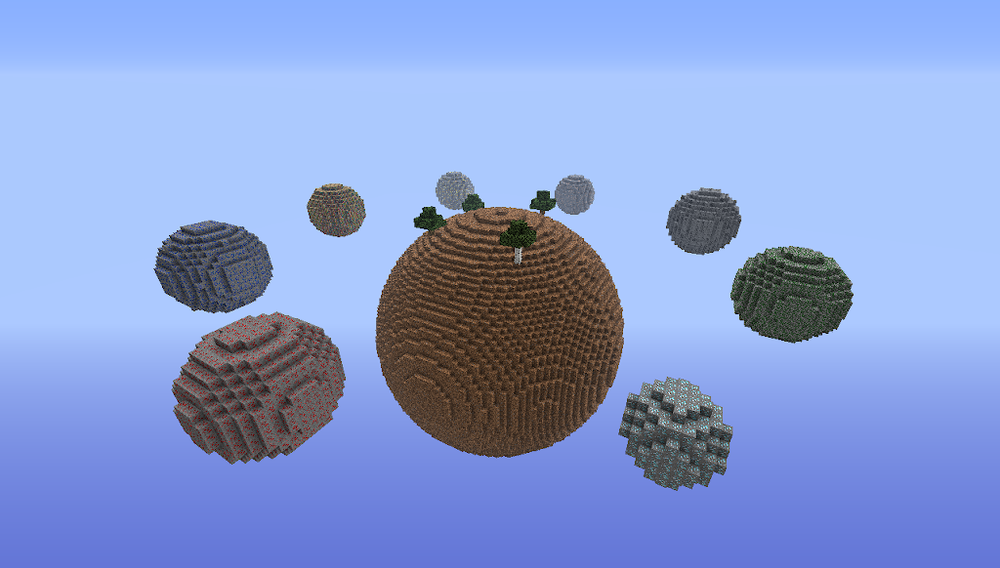
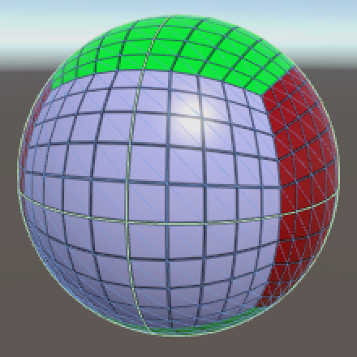
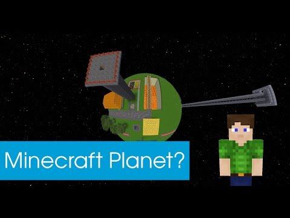
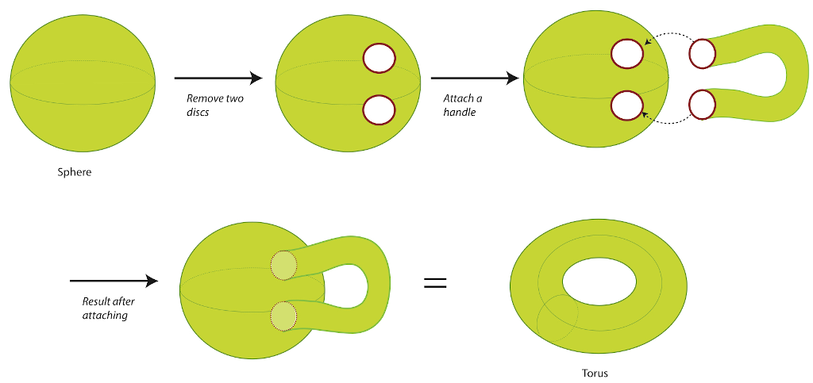
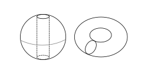
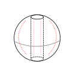

# 映射方塊世界到球形宇宙

## 前言

一切的命題源自於：我想創造一個多行星的 Voxel 宇宙。並且我不想使用 Minecrat 那種透過傳送點連接不同世界的方式 (Stargate SG-1 Style 宇宙)，也就是我必須建立 Voxel World 的行星型態，並且漂浮在宇宙之中。當然我也找了一些參考資料。

## 型態

### Starmade 風格

這種模式的行星不具有對稱性，無法發揮「宇宙沒有上下之分」的特性。

### 常見的 Minecraft 美術圖風格

這種模式沒有有效的處理邊界重力方向的手段。

### 常見的 Minecraft 模組風格

如果重力方向統一，那依然是有上下之分的宇宙，而如果重力在行星內部，則一部分區域的重力方向無法垂直 Voxel。

### 立方體映射模式

無法處理邊界問題。

### 環面 (Torus)

方形的平面世界透過銜接兩個垂直方向的邊界，使其成為一個環面 ，也就是吃豆人 (PC-Man) 的世界。

## 映射到宇宙

環面賦予了 "Voxel 行星" 一定的星球性質，然而直接將其放到宇宙中會變成漂浮在太空中的甜甜圈。若直接使用映射特性，讓一個環面映射到另外一個環面，則會很難解決多行星的問題。

直到這張圖給了我靈感：

把甜甜圈偽裝成球形就可以了啊！ヽ(◐∀◔)ノ

然而這會使陷在「內部」的地表無法受到日照，且前往行星對面的距離遠小於「外部」的地面。

那麼讓它以垂直方向流動以實現「自轉」，以統計的方式處理「內部」土地與「外部」土地的不對稱性。

###### tags: `project` `ASMCBINFH`

###### tags: `development note` `2021-01-21`

