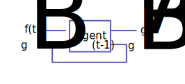
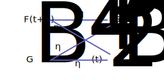

# 智能體資訊複雜度

首先考慮一個具有記憶能力的邏輯單元（也許是RNN），
它的輸出 $g(t)$ 受到當前輸入 $f(t)$ 與先前部份輸出 $g_B(t-1)$ 的影響。

我們可以透過一個空想實驗來理解這個過程：

> 1. 今天我看到小明吃蘋果

"小明吃蘋果"這段資訊就是 $f(0)$ ，但是我並不會因為這個資訊而特別做出什麼行為，僅僅只是記著。

> 2. 隔天我又看到小明吃蘋果。

隔天看到"小明吃蘋果"這段資訊就是 $f(1)$，而"小明昨天也吃蘋果"就是 $g_B(0)$，把這兩個資訊揉合在一起，我產生了新的概念"小明連續吃了兩天的蘋果"；這就是$g_B(1)$

> 3. 如此一般持續過了一個月，小明幾乎天天吃蘋果。（爾偶不吃）

究竟哪一天小明有沒有吃蘋果，我並不會清楚的記得，而是變成"小明過去一個月經常吃蘋果"這樣一個概念記在腦海中，而這個概念就是 $g_B(30)$。

> 4. 小明今天心情似乎很糟，而且還沒見他今天吃蘋果。

"小明心情很糟，沒吃蘋果"這個資訊就是 $f(31)$。

> 5. 於是我買了蘋果送給他

"買蘋果送他"這個觸發行為的指令就是 $g_A(31)$。

當然，這是一個簡化的空想實驗，以天為最小時序單位、一些邏輯映射關係也直接省略（如："買蘋果送他"這個輸出似乎還應該夾帶"別人不開心我也不開心"或"小明對我而言是個特別的人"...之類的其他輸入資訊才能發生的邏輯映射。

只是為了方便讀者釐清幾個簡單的概念：

1. 智能體的當前決策，來自當前認知以及先前記憶造成的邏輯映射。
2. 資訊會被壓縮並丟失。
3. 資訊的壓縮與丟失不只發生在認知，也發生在記憶。
4. 因此智能體不會 100% 的記憶所有細節。

## 輸入資訊量、記憶資訊量與資訊損失之間的關係

接著我進行了幾個假設：

1. 所有輸入與輸出的資訊都是二進制的數組
3. 只在乎資訊的量，而不在乎內容，也就是數組的位元數
4. 輸入的資訊量不隨時間改變( $\forall t:F=F(t)$ )

於是我列出了下式：

$$
G_B(t+1)=\eta_1 F(t+1) + \eta_2 G_B(t)
$$

$G$：輸出的資訊量，也就是位元數
$F$：輸入的資訊量
$\eta_1,\eta_2$：資訊殘留率，其值小於等於1

對任意時間而言的輸出資訊量，來自於當前輸入資訊量流失；以及先前輸出的資訊流失後的加總。

於是我們可以列出：

$$
G_B(t+1)=\eta_1 F + \eta_2 G_B(t)
$$

$$
G_B(t+2)=\eta_1 F + \eta_2 \eta_1 F + \eta_2 ^2 G_B(t)
$$

$$
G_B(gt+3)=\eta_1 F + \eta_1 \eta_2 F+ \eta_1 \eta_2 ^2 F + \eta_2 ^3 G_B(t)
$$

可以歸納出：

$$
G_B(t+n)=\eta_1 F \sum_{i=0}^n \eta_2 ^i + \eta_2 ^n G_B(t)
$$

若考慮在無窮的時間後，智能體被資訊塞滿的情況：

$$
G_B=\lim_{n \rightarrow \infty} G(t+n) =\frac{\eta_1 F}{1-\eta_2}
$$

### 資訊殘留率的測定
對任意輸出位元 $g_i(t)$，其值決定於 $f(t)$ 與 $g(t-1)$ 的布林函式。

固定 $g(t-1)$ 後窮舉 $f(t)$ ，輸出可能的排列組合數比上輸入的排列數，即為$\eta_1$：

$$
\eta_1 = \Bbb{E}(
    \frac{\log_2(\#g_{B,t})}
    {\log_2(\#g_t)}
    |g_{B,t-1}
)
$$

固定 $f(t)$ 後窮舉 $g(t-1)$ ，輸出可能的排列組合數比上輸入的排列數，即為$\eta_2$：

$$
\eta_2 = \Bbb{E}(
    \frac{\log_2(\#g_{B,t})}
    {\log_2(\#g_{B,t-1})}
    |f_t
)
$$

※ "$\#$" 是集合元素數量的意思。

如果資訊位元數過高，窮舉成本過大，或許可以用抽樣的方式處理。

### 關於資訊殘留率
理工的朋友看到 $\eta$ 這個記號應該會很容易連想到功率，
但是最初在設計變數的時候我是想使用 $\lambda$ 作為記號的，
畢竟它經常被使用在「衰減」的場合，而這是一個資訊衰減的場合，
不過半衰期的方程式是指數型態的，而我想描述的是一組線性方程式。

另外一個候選方案是沿用電腦科學領域已經有的資訊壓率，但是很遺憾的，
資訊壓縮率的定義與我期望使用的殘留率剛好是倒數關係；
資訊壓縮率是一個大於 1 的數值。

值得一提，還有另外一個與資訊殘留率接近但是本文並沒有使用到的概念，
生存函數（Survival function），它是一個隨著時間衰減，
並且介於 0 到 1 之間的函數，不過它的衰減模式是一個變化的過程，
而且考慮的是連續的時間。（本文的模型是離散的，而且衰減模式固定）

## 衡量智能體的智能程度

我的目的是為了分析布林類神經網路才建立這個模型的，
不過仔細想想，這個模型好像能描述各種「具有記憶能力的智能體」。

智能體基本上是一個映射函數，反應輸入到輸出之間的映射關係，
而在此模型中，為了簡化問題，所有映射關係都由布林運算完成。

$F$：輸入智能體的資訊量，單位為 bit
$G_A$：輸出智能體的資訊量，單位為 bit
$G_B$：記憶於智能體的資訊量，單位為 bit
$\eta$：資訊殘留率

注意，資訊量描述的並不是有幾條線。舉例來說 3bit 的解碼器，其輸出有 8 條線，但是資訊量仍為 3 bit，資訊量的定義如下：
$$
F = \log_2(\#f)
$$

### 智能體極限記憶能力評估

透過實驗（解析布林函數）的方式可以獲得 $\eta_1$、$\eta_2$ ，
再透過公式便可計算出該智能體最多能儲存多少資訊：

$$
G_B =\frac{\eta_1 F}{1-\eta_2}
$$

### 理想的行為複雜度

行為複雜度 $G_A$ 可以很直觀的列出：

$$
G_A = \eta_3 F + \eta_4 G_B
$$

接著我們把極限記憶能力 $G_B$ 代入可得：

$$
G_A = F (\eta_3 + \frac{\eta_1 \eta_4}{1-\eta_2})
$$

然後我們假設：

- $f(t+1)$ 的資訊會被完全映射到 $g_B(t+1)$ ，$\eta_1=1$
- $f(t+1)$ 和 $g_B(t)$ 的資訊會完全映射到 $g_B(t+1)$ ， $\eta_3=\eta_4=1$

便會得到下式，某種程度上理想條件的行為複雜度：

$$
G_{A,\text{ideal}} = F (1 + \frac{1}{1-\eta_2})
$$

這是決定智能體輸入資訊複雜度 $F$ 與記憶率 $\eta_2$ 之後，所能預期智能體的理想狀態的行為複雜度，此時的 $g_A$ 是一個對射函數。

唯獨 $\eta_2$ 不能假設為 1 的原因是，該公式的先決條件是在無窮的時間後，智能體的記憶單元塞滿了資訊，如果智能體無法忘記資訊，則 $G_B$ 會發散（智能體可以儲存無限的資訊），如此假設並沒有實際的意義。

### 行為複雜度

根據公式：

$$
G_A = F (\eta_3 + \frac{\eta_1 \eta_4}{1-\eta_2})
$$

我們可以透過[實驗](\#資訊殘留率的測定)獲得資訊殘留率，而輸入資訊量 $F$ 是網路結構給定的，這樣便可測定智能體的行為複雜度。

如此一來便可將智能體在不需要仰賴模擬環境的情況下進行分析，而這個分析結果代表著「終端狀態」，比如：

- 無限的時間之後的記憶能力
- 記憶體充滿資訊的完全狀態的智能體的反應
- 終端穩定狀態智能體丟失資訊的數量
- etc.

但是我們也可以將智能體丟在環境中，取樣一段時間來評估資訊殘留率，
從而統計智能體在不同環境中，隨時間變化而產生的行為複雜度差異。

### 成熟假說
在一開始的 $\eta_3$ 應該會偏大， $\eta_4$ 偏小，
智能體在記憶（學習）環境之前的反應仰賴當前接收的資訊，
$G_B$ 偏小，因為沒有多少資訊被記憶。

當智能體漸漸成熟後，反應仰賴於過去經驗，
$\eta_3$ 應該會慢慢變小，而 $\eta_4$ 漸漸增加。

直到 $G_B$ 到達極限，此時智能體無法再學習更多資訊了，即便有 $F$ bit 的資訊進入，但是同時也會有 $F$ bit 的資訊遺失，推導如下：

$$
\text{loss} = G_B(1-\eta_2) + F(1-\eta_1)
=\eta_1 F + F(1-\eta_1)
=F
$$

可以非常容易的理解 $G_B$ 就是網路結構賦予智能體的學習空間。

###### tags: `The Key Of Huanche`