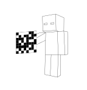

# 論開放世界原生智能體的發想 

在大多數 RPG (role-playing game) ，增加遊戲性的方式就是提高敵人的性能（血量、防禦力、魔量、屬性防禦、屬性傷害、附加狀態、特殊技能、二階段變身...等等）的方式，很少採用單純提高敵人智能的方式，即便是即時戰略遊戲，常見的方式也是增加資源量、提高生產速度...等直接修改遊戲特性的方式來提高敵人難度。

以 Minecraft 為例，不論是官方的開發、非官方的模組/插件或是多人伺服器營運者的調整方向，也都是透過這種方式來維持遊戲性。因此設想一種非人類玩家 NHP（non-human player），其各種遊戲數據皆和玩家相同，也就是建造一個實體表現等同於玩家實體的 NPC 實體，如：

* 血量等同玩家
* 經驗值等同玩家（能夠儲存經驗值）
* 移動速度等同玩家
* 背包欄位等同玩家
* 死亡後會掉落背包物品及經驗值
* etc.

與一般 NPC 關鍵性的差異來自 NHP 是玩家 (player)，它必須具備接近人類玩家的智能表現，並且具備一定程度的集團活動能力。

因此我們可以想像在真實玩家進入遊戲世界之前， NHP 就在遊戲世界中活動並且具有一定規模的組織並且進行著經濟活動，那個 NHP 與真實玩家之間的關係應該為何呢？遊戲終究要服務玩家； NHP 也不利外，如果 NHP 無法滿足某種需求，那麼 NHP 的存在就只是一場白日夢罷了。

## NHP 的使用方式

若單純作為人類玩家的對手而存在，以 AOFE（Age of Empires II: Forgotten Empires）為例，當中有非官方製作強度極高的 AI ，主要是透過非人類的微操作方式來給人類玩家帶來壓力，但是這種高強度的對手僅能刺激少數玩家的好勝心。比起滿足少數市場需求，能滿足市場最大需求才是利多的作法。

目前多數 Minecraft 伺服器採用的方式是由人類建造地形、放置 NPC、官方商店...等手法營造城鎮的氣氛。地形使用權限插件鎖定以免於遭受玩家破壞；NPC 則是編寫了簡單的對話或是賦予任務、雇傭、交易等功能；官方商店的功能則是如同大部份 MMORPG ：用於回收物品與發行貨幣。這種作法似乎犧牲的開放式世界的優點：高度的自由，但是對多人伺服器而言似乎也只能限制玩家的部份自由來維持伺服器的秩序。

若能賦予 NHP 一定的自主能力，便可在缺少玩家的情況下在沙盒世界運行一定規模的組織系統。有如影集西部世界（Westworld）一般，在玩家進入以前，整個遊戲世界就有自己的居民「運作」著，雖然仍需透過工作人員維護，但是對遊客（玩家）而言，營運方是透過這些「接待員」間接和玩家接觸，遊客（玩家）不會直接感受到營運方的存在。

以維護城鎮的治安為例。在 Minecraft 伺服器常見的作法是設定保護區，在管理員設定的範圍內 PvP 行為直接由系統鎖死而不允許發生。若使 NHP 具有排除犯罪者的機能，作法類似 EVE online 的安全等級（Security Status），在保護區進行 PvP 行為的玩家會遭到 NHP 通緝，戰鬥型的 NHP 會對受到通緝的玩家採取戰鬥行為，使遭通緝的玩家無法再次踏入保護區。

NHP 能夠填充缺乏玩家扮演的角色，比如當玩家大多數都想建造時， NHP 便能填補礦工、資源採集者的角色，當然玩家仍需透過市場機制來換取這些資源。更甚者，當玩家離線後交由 NHP 持續代理，以滿足玩家上線後的物資消耗需求。

NHP 得以獲得實踐並滿足上述需求，這種手法同樣能應用在其他開放式世界的遊戲上。

## Minetestian

比起 Minecraft 有其他更適合作為 NHP 訓練的 Minecraft-like 環境：Minetest。Minetest（全稱為Minetest-c55）是一個LGPL許可的是一個免費開源沙盒建造遊戲，是一個用 C++ 語言並使用了 Irrlicht的 3D 引擎的遊戲，且能在 Windows、Linux、FreeBSD 和 Mac OS 等平台執行且它是一個和Minecraft類似，且玩法雷同的獨立遊戲，由「celeron55」Perttu Ahola和其他貢獻者是在LGPL下發布的自由軟體。[^minetest]

NHP 所仰賴的界面必定會與一般人類玩家的操作體驗有所差異，因此程式修改的彈性也是一個需要考量的因素之一。Minecraft 是一款商業軟體，目前遊戲生態系中的的插件和模組是社群透過逆向工程伺服器程式，並且在當中植入事件監聽程序從而達到撰寫插件的目的，或是透過逆向工程的產物建立 API 供模組調用。另一方面來說，遊戲本身的原始碼是封閉的，因此難以修改。Minetest 不只本身是開源的專案，而且其程式本身就支援以 Lua  語言撰寫的插件或模組，具有更高的彈性。

以撰寫語言來講，Minetest 使用 C++ 撰寫，具有比起 Java 更高的執行效率，執行效率對機器學習而言也是不可或缺的要素。

既然 NHP 會作為 Minetest 的原生居民，那個總該給個名字吧？目前暫定稱呼為 Minetestian 囉！[^字尾]

> 關於訓練環境是否使用 Minetest 計畫有變 (2020-03-12 updated)

### 他們如何溝通？

> 與一般 NPC 關鍵性的差異來自 NHP 是玩家 (player)，它必須具備接近人類玩家的智能表現，並且具備一定程度的**集團活動能力**。

代表他們之間必須要有交換資訊的手段，反正聲音肯定是行不通的，太複雜了。那麼要像玩家一樣使用文字嗎？如果採用這個方案會間接產生很多問題：

- 要像在 Minecraft 一樣，在遊戲中玩家的訊息預設是全頻（所有人都收得到）的嗎？
- 如何妥善的處理輸入與輸出的結構？
- 字串的編碼如何處理？（只允許人類使用的英文數字還是所有字元？）
- ...

全頻的問題可以透過程式約束成只能傳播在某個範圍內，但是密頻又要如何處理呢？乍看之下是人類玩家進入遊戲後可以直接與之溝通，不過衍生的問題太多了，這似乎不是一個恰當的方案。

直到前一陣子「異星入境」這部電影給了我靈感[^異星入境]，既然我打算讓 NPH 用電腦的方式思考：布林代數，那我為何不讓電腦用電腦的方式溝通呢？二維條碼似乎是電腦存在於三維空間中最合適的溝通手段了，輸入直接使用視覺就能處理，而輸入就使用類似劇中手法：直接生成平面圖形。

[^minetest]:  台灣摩特世界 | MINETEST@TW. (n.d.). Retrieved 2019-11-15, from  https://sites.google.com/site/minutesttw/
[^字尾]: 「Taiwanese」字尾之淵源. (n.d.). Retrieved 2019-11-16, from https://elysii.net/1095
[^異星入境]: 《異星入境》的外星語言是怎麼回事？ - PanSci 泛科學. (n.d.) Retrieved 2019-11-16, from https://pansci.asia/archives/114673

###### tags: `The Key Of Huanche`