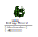
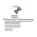
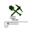
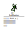
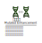

# BNN Tools

## 染色體編碼

布林類神經網路數位染色體 (Boolean Neural Network Digital Chromosome)，於本專案皆簡稱為染色體。

## 對象

| 1 | 2 | 3 |
| :---------------------------------------------------: | :-------------------------------------------------: | :----------------------------------------: |
|  |  |  |

## 工具

## 行為

